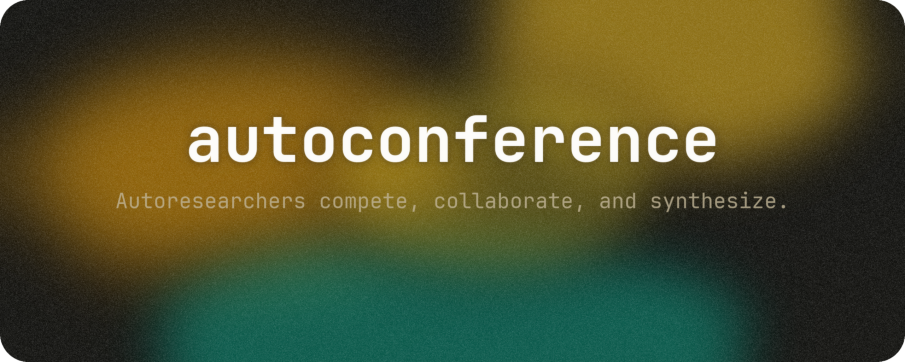
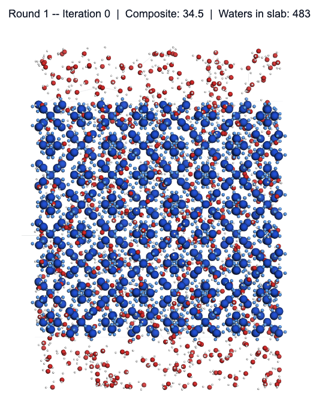
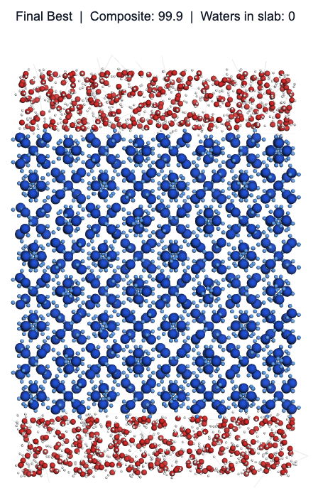
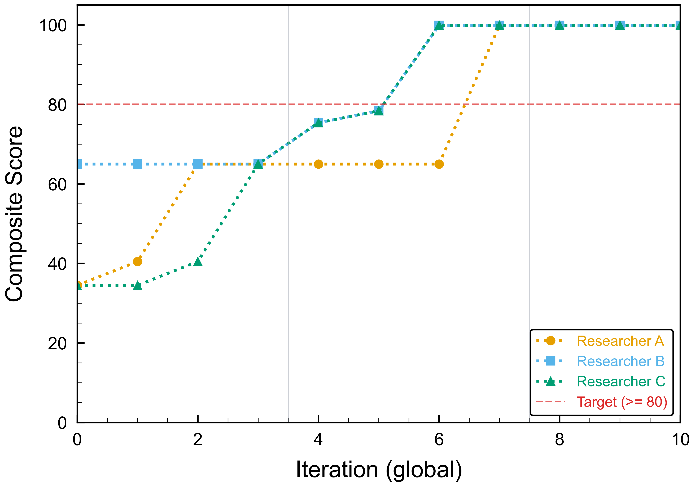
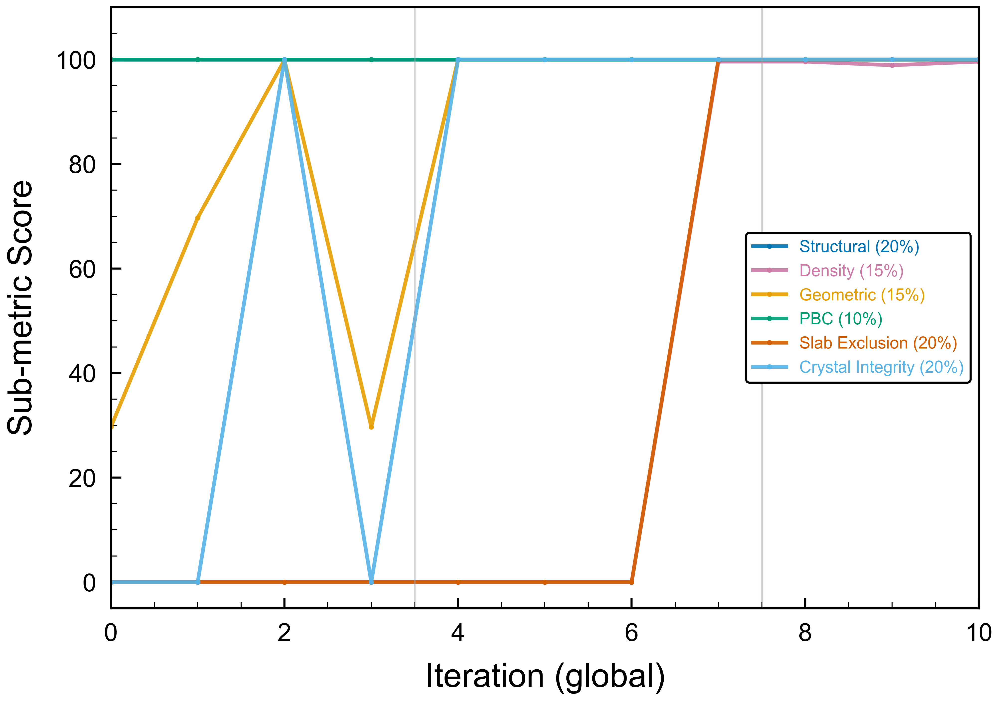

<p align="center"></p>
<h1 align="center">autoconference</h1>
<p align="center">
  <em>자율 연구자들이 경쟁하고, 협력하며, 돌파구를 합성하는 컨퍼런스를 생성합니다.</em>
</p>
<p align="center">
  <a href="#빠른-시작">빠른 시작</a> · <a href="#작동-방식">작동 방식</a> · <a href="#템플릿">템플릿</a> · <a href="#autoresearch-skill과의-관계">autoresearch-skill</a> · <a href="./README.md">English</a>
</p>
<p align="center">
  
  
  
  
</p>

---

> [!NOTE]
> N개의 병렬 autoresearch 에이전트를 구조화된 컨퍼런스 라운드로 조율하는 Claude Code 스킬입니다 -- 적대적 동료 검토와 교차 연구자 합성을 포함합니다. 연구 목표를 정의하는 `conference.md`를 작성하면 컨퍼런스가 가설 생성, 실험, 평가, 다중 에이전트 반복을 처리합니다. [autoresearch-skill](https://github.com/wjgoarxiv/autoresearch-skill) 기반. Claude Code, Codex CLI, Gemini CLI에서 작동합니다.

### 예시: sII 수화물 + 물 .gro 파일 생성

| 라운드 1 (초기) | 최종 (수렴) |
|:---:|:---:|
|  |  |
| 복합 점수: 34.5 — 슬랩 내 물 존재 | 복합 점수: 99.9 — 깨끗한 분리 |

| 수렴 곡선 | 세부 지표 |
|:---:|:---:|
|  |  |

> 3명의 연구자가 3라운드에 걸쳐 33회 반복. 컨퍼런스가 결정 구조 보존과 수화물 슬랩에서의 물 배제를 학습합니다. [전체 예시 보기 →](./examples/sii-hydrate-generation/)

## TL;DR

연구 목표를 설명하는 `conference.md`를 작성하면, autoconference가 구조화된 라운드에서 경쟁하는 N개의 병렬 autoresearch 에이전트를 생성합니다. 각 라운드 후 리뷰어 에이전트가 발견 사항을 적대적으로 검증하며, 검증된 인사이트는 모든 연구자에게 공유됩니다. 최종적으로 합성기가 단순히 승자를 선택하는 것이 아니라 상호 보완적인 발견들을 결합한 통합 결과물을 생성합니다.

## 작동 방식

```
┌─────────────────────────────────────────────────────────┐
│                    컨퍼런스 라운드                          │
│                                                           │
│  Phase 1: 독립 연구 (병렬)                                │
│  ┌──────────┐ ┌──────────┐ ┌──────────┐                 │
│  │연구자    │ │연구자    │ │연구자    │  각각 N번         │
│  │    A     │ │    B     │ │    C     │  autoresearch     │
│  │ (iter×N) │ │ (iter×N) │ │ (iter×N) │  반복 수행        │
│  └────┬─────┘ └────┬─────┘ └────┬─────┘                 │
│       │             │            │                        │
│  Phase 2: 포스터 세션                                     │
│  ┌──────────────────────────────────────┐                │
│  │ 세션 의장이 모든 로그를 수집하고,    │                │
│  │ 주요 발견 사항과 변화를 정리합니다   │                │
│  └──────────────────┬───────────────────┘                │
│                     │                                     │
│  Phase 3: 동료 검토 (적대적)                              │
│  ┌──────────────────────────────────────┐                │
│  │ 리뷰어 에이전트가 주장을 검증합니다: │                │
│  │ - "지표가 실제로 개선되었는가?"      │                │
│  │ - "과적합이 아닌가?"                 │                │
│  │ - "측정 노이즈일 가능성은?"          │                │
│  └──────────────────┬───────────────────┘                │
│                     │                                     │
│  Phase 4: 지식 전달                                       │
│  ┌──────────────────────────────────────┐                │
│  │ 검증된 발견 사항이 다음 라운드를 위해│                │
│  │ 모든 연구자에게 공유됩니다           │                │
│  └──────────────────────────────────────┘                │
│                                                           │
└─────────────────────────────────────────────────────────┘
          │
          ▼  수렴 확인 → 다음 라운드 또는 최종 합성
```

## 빠른 시작

### 1. 설치

```bash
# 저장소 클론
git clone https://github.com/wjgoarxiv/autoconference-skill.git
cd autoconference-skill

# 스킬 디렉토리에 심볼릭 링크 생성
mkdir -p ~/.claude/skills
ln -s "$(pwd)" ~/.claude/skills/autoconference-skill
```

### 2. 컨퍼런스 프로젝트 스캐폴드 생성

```bash
python scripts/init_conference.py \
  --goal "Optimize inference latency" \
  --metric "p95_latency_ms" \
  --direction minimize \
  --target "< 50" \
  --researchers 3 \
  --strategy assigned \
  --output ./my-conference/
```

정성적 모드(문헌 리뷰, 가설 생성)의 경우:

```bash
python scripts/init_conference.py \
  --goal "Survey LLM agent papers" \
  --mode qualitative \
  --criteria "Comprehensive taxonomy with 15+ papers and 3 research gaps" \
  --researchers 3 \
  --output ./lit-review/
```

### 3. `conference.md` 편집

`Current Approach`, `Search Space`, 연구자별 집중 영역을 채워 넣으세요. 스캐폴드가 나머지 항목들을 미리 채워줍니다.

### 4. 컨퍼런스 실행

Claude에게 다음과 같이 입력하세요:
```
Run the autoconference on my conference.md
```

Claude가 `SKILL.md`를 로드하고, `conference.md`를 읽은 후, 모든 라운드, 동료 검토, 최종 합성을 포함한 전체 컨퍼런스를 오케스트레이션합니다.

## `conference.md` 형식

| 섹션 | 용도 |
|------|------|
| `Goal` | 컨퍼런스가 달성해야 할 목표 |
| `Mode` | `metric` (수치 최적화) 또는 `qualitative` (추론 품질) |
| `Success Metric` | 지표 이름, 목표값, 방향 (metric 모드 전용) |
| `Success Criteria` | "좋음"에 대한 자연어 설명 (qualitative 모드 전용) |
| `Researchers` | 연구자 수, 라운드당 반복 횟수, 최대 라운드 수 |
| `Search Space` | 연구자가 수정할 수 있는 것과 없는 것 |
| `Search Space Partitioning` | `assigned` (각 연구자에게 집중 영역 지정) 또는 `free` (중복 허용) |
| `Constraints` | 최대 반복 횟수, 시간 예산, 연구자 타임아웃 |
| `Current Approach` | 기준선 설명 |
| `Shared Knowledge` | 각 라운드 후 검증된 발견 사항으로 자동 채워짐 |
| `Conference Log` | 라운드별 히스토리가 자동으로 유지됨 |

전체 템플릿은 `assets/conference_template.md`를 참조하세요.

## 에이전트 역할

| 역할 | 모델 | 수 | 책임 |
|------|------|----|------|
| **컨퍼런스 의장 (Conference Chair)** | Sonnet | 1 | 오케스트레이터 — 라운드 관리, 연구자 생성, 수렴 감지, 합성 트리거 |
| **연구자 (Researcher)** | Sonnet | N | 할당된 탐색 공간 내에서 autoresearch 5단계 루프 실행 |
| **세션 의장 (Session Chair)** | Haiku | 1 | 경량 요약기 — 로그 수집 및 각 라운드 후 포스터 세션 요약 생성 |
| **리뷰어 (Reviewer)** | Opus | 1 | 적대적 비평가 — 주장 검증, 과적합/노이즈 확인, 판정 부여 |
| **합성기 (Synthesizer)** | Opus | 1 | 최종 한 번 실행 — 모든 연구자의 상호 보완적 인사이트를 결합 |

## 출력 파일

| 파일 | 용도 |
|------|------|
| `conference.md` | 사용자 설정 (각 라운드마다 로그 항목이 업데이트됨) |
| `conference_results.tsv` | 모든 반복 및 동료 검토 판정이 포함된 마스터 컨퍼런스 수준 TSV |
| `researcher_A_log.md` | 연구자별 상세 반복 로그 |
| `researcher_A_results.tsv` | 연구자별 TSV (autoresearch와 동일한 형식) |
| `poster_session_round_N.md` | 각 라운드의 세션 의장 요약 |
| `peer_review_round_N.md` | 각 라운드의 리뷰어 판정 |
| `synthesis.md` | 합성기의 최종 합성 결과물 |
| `final_report.md` | 전체 컨퍼런스 히스토리가 포함된 요약 보고서 |

## 템플릿

일반적인 작업에 바로 사용 가능한 `conference.md` 설정:

| 템플릿 | 모드 | 사용 사례 |
|--------|------|-----------|
| `templates/quick-conference.md` | metric | 연구자 2명, 2라운드 — 컨퍼런스 형식이 문제에 적합한지 테스트 |
| `templates/prompt-optimization.md` | metric | 3명의 전문 연구자를 통한 LLM 프롬프트 정확도 최적화 |
| `templates/code-performance.md` | metric | 알고리즘, 자료구조, 저수준 연구자를 통한 코드 속도 최적화 |
| `templates/research-synthesis.md` | qualitative | 기초, 최신, 교차 도메인 관점에서의 문헌 탐색 |

## 설정 옵션

| 필드 | 기본값 | 설명 |
|------|--------|------|
| `mode` | `metric` | `metric` 또는 `qualitative` |
| `count` | — | 연구자 에이전트 수 |
| `iterations_per_round` | 5 | 라운드당 각 연구자가 실행하는 autoresearch 반복 횟수 |
| `max_rounds` | 4 | 강제 합성 전 최대 컨퍼런스 라운드 수 |
| `max_total_iterations` | — | 모든 연구자와 라운드에 걸친 하드 상한 |
| `time_budget` | — | 전체 컨퍼런스의 벽시계 시간 제한 |
| `researcher_timeout` | — | 라운드당 연구자별 타임아웃 |
| `strategy` | `free` | `assigned` (집중 영역) 또는 `free` (자유 탐색) |

## autoresearch-skill과의 관계

컨퍼런스의 각 연구자는 **autoresearch 루프** — [autoresearch-skill](https://github.com/wjgoarxiv/autoresearch-skill)의 동일한 자율 실험-평가-반복 사이클 — 을 실행합니다. Autoconference는 그 위에 세 가지 레이어를 추가합니다:

1. **다중 에이전트 오케스트레이션** — N명의 연구자가 탐색 공간의 서로 다른 부분을 병렬로 탐색한 후 발견을 공유합니다
2. **적대적 동료 검토** — 리뷰어 에이전트가 각 라운드마다 발견 사항을 검증합니다 (자기 평가로는 놓칠 수 있는 것을 포착)
3. **합성** — 합성기가 단순히 최선의 결과를 선택하는 것이 아니라 상호 보완적인 인사이트를 결합합니다

탐색 공간이 단일 집중 연구 루프에 적합하다면 autoresearch-skill을 사용하세요. 탐색 공간이 충분히 커서 분할이 가능하거나, 접근 방식의 다양성이 중요하거나, 결과의 외부 검증이 필요할 때는 autoconference를 사용하세요.

## 크로스 플랫폼 호환성

| 플랫폼 | 지원 | 상태 |
|--------|------|------|
| Claude Code | 지원 | 준비됨 — 병렬 연구자 생성을 위해 `Agent` 도구 사용 |
| Gemini CLI | 미지원 | 향후 지원 예정 — 서브에이전트 API 연구 필요 |
| Codex CLI | 미지원 | 향후 지원 예정 — 서브에이전트 API 연구 필요 |

## 요구사항

| 요구사항 | 상세 |
|----------|------|
| **Python** | 3.8+ (표준 라이브러리만 사용) |
| **Claude Code** | 병렬 실행을 위한 `Agent` 도구 지원 필요 |
| **autoresearch-skill** | 각 연구자 에이전트 프롬프트에서 참조됨 |

## 라이선스

MIT — 자세한 내용은 [LICENSE](./LICENSE)를 참조하세요.
