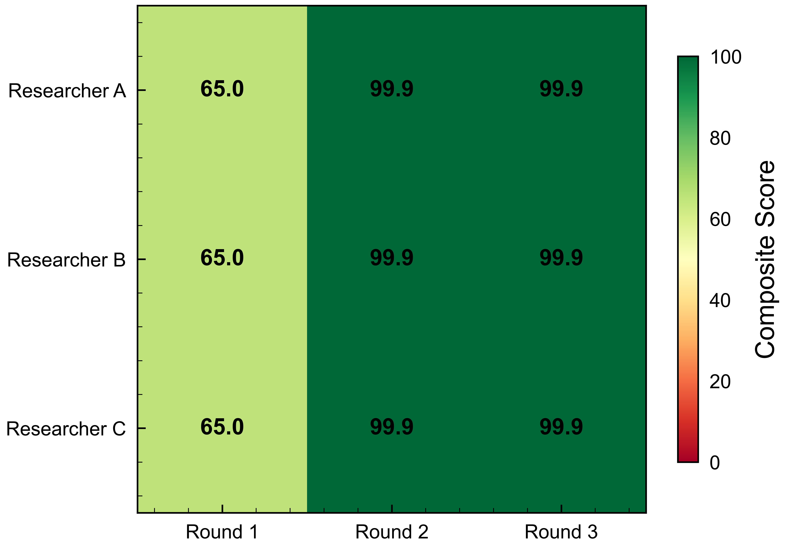
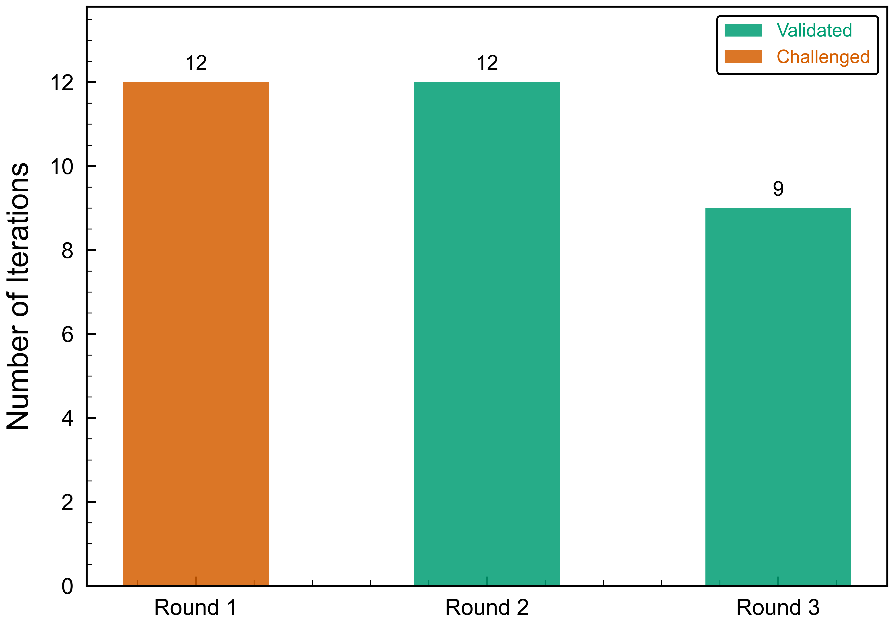
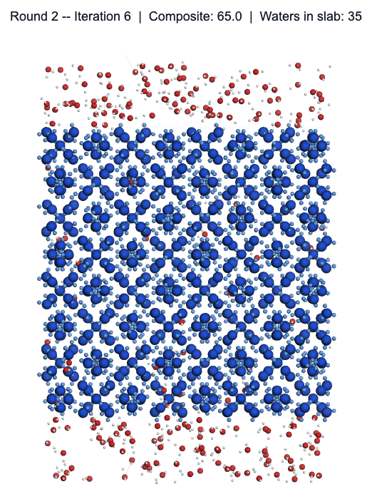

# sII Hydrate + Water Generation Conference

> Demonstrating autoconference on a molecular simulation task: generating a valid sII clathrate hydrate + water `.gro` file with crystal structure preservation and water exclusion.

## Results

| Composite Score Convergence | Sub-metric Breakdown |
|:---:|:---:|
|  |  |

| Researcher Comparison | Peer Review Verdicts |
|:---:|:---:|
|  |  |

## Structure Evolution Across Iterations

The 3D snapshots below show how the molecular structure improves as the conference iterates. Blue = hydrate O atoms (crystal slab), Red = water O atoms. Gray planes mark the slab z-boundaries.

| Round 1 (Iteration 0) | Round 2 (Iteration 6) | Final Best |
|:---:|:---:|:---:|
|  |  |  |
| Composite: 34.5 | Composite: 65.0 | Composite: 99.9 |
| 483 waters in slab | 35 waters in slab | **0 waters in slab** |

> In Round 1, water molecules (red) are scattered everywhere including inside the hydrate slab. By the final iteration, clean separation is achieved — water exists only above and below the slab.

## Key Findings

- **Crystal integrity** and **slab exclusion** both start at 0 in Round 1 (researchers naively scale crystal and place water everywhere)
- Peer review flags both issues → researchers converge to proper approach by Round 3
- Final composite: **99.9/100** with crystal deviation < 0.0001 nm and zero water in slab

## Files

| File | Description |
|------|-------------|
| `conference.md` | Conference specification and scoring rubric |
| `conference_results.tsv` | Per-iteration scores and peer review verdicts |
| `conference_events.jsonl` | Raw event log from all rounds |
| `evaluate.py` | Scoring script (6 sub-metrics → composite) |
| `generate_hydrate.py` | Researcher submission script |
| `run_iterations.py` | Orchestration: runs researchers × rounds |
| `visualize.py` | Generates this plot set |
| `reference_crystal.gro` | Ground-truth sII crystal structure |
| `sii_hydrate_water.gro` | Final best submission |
| `final_report.md` | Synthesis and conclusions |
| `iterations/` | Per-iteration `.gro` outputs and `_scores.json` files |
| `render_snapshots.py` | Generates 3D molecular structure snapshots |
| `snapshot_round1.png` | Round 1 structure (water in slab) |
| `snapshot_round2.png` | Round 2 structure (partial exclusion) |
| `snapshot_final.png` | Final structure (clean separation) |
| `results.png` | Combined 4-panel figure |
